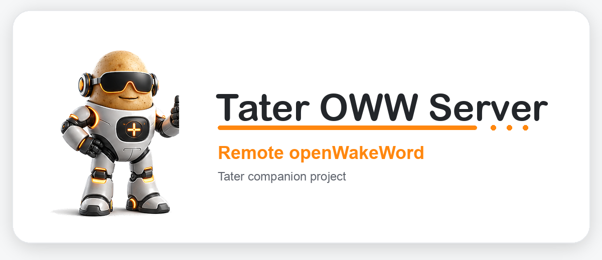

<div align="center">
  <a href="https://taterassistant.com">
    
  </a>
</div>
<h3 align="center">
  <a href="https://taterassistant.com">taterassistant.com</a>
</h3>

# Tater OWW Server

Standalone openWakeWord server for Tater satellite firmware.

This service implements the remote wake stream that the Tater firmware expects:

```text
WS   /api/openwakeword/stream
```

Satellites keep one WebSocket connection open and send raw PCM frames until the
server reports a wake word.

## Quick Start

CPU:

```bash
docker compose up --build
```

NVIDIA GPU:

```bash
docker compose -f docker-compose.nvidia.yml up --build
```

Then set the satellite firmware value:

```text
openwakeword_server_url: ws://YOUR_SERVER_IP:8502
```

The firmware automatically streams to `/api/openwakeword/stream`. `http://`
and `https://` values are accepted in the firmware UI, but the device converts
them to `ws://` or `wss://` and still uses the stream.

## Firmware Contract

Preferred stream:

```text
WS /api/openwakeword/stream?selector=kitchen-satellite&wake_word=hey_tater&rate=16000&bits=16&channels=1
Binary frames: pcm_s16le audio
Text responses: JSON
```

Response when no wake word is detected:

```json
{"ok": true, "detected": false}
```

Response when detected:

```json
{
  "ok": true,
  "detected": true,
  "wake_word": "hey_tater",
  "score": 0.72,
  "engine": "openwakeword",
  "model_source": "hey_jarvis"
}
```

## Configuration

Environment variables:

| Name | Default | Description |
| --- | --- | --- |
| `TATER_OWW_HOST` | `0.0.0.0` | HTTP bind host. |
| `TATER_OWW_PORT` | `8502` | HTTP bind port. |
| `TATER_OWW_MODEL` | `hey_jarvis` | Pretrained model name, local path, or HTTP(S) model URL. |
| `TATER_OWW_FRAMEWORK` | `onnx` | `onnx` or `tflite`. |
| `TATER_OWW_DEVICE` | `auto` | `auto`, `cpu`, or `gpu`. |
| `TATER_OWW_THRESHOLD` | `0.95` | Detection threshold. |
| `TATER_OWW_PATIENCE` | `4` | Consecutive threshold hits required. |
| `TATER_OWW_DEBOUNCE_S` | `8.0` | Minimum seconds between detections per satellite. |
| `TATER_OWW_VAD_THRESHOLD` | `0.0` | Optional openWakeWord internal VAD threshold. |
| `TATER_OWW_MODEL_DIR` | `/models` | Directory for downloaded/custom model files. |
| `TATER_OWW_IDLE_TTL_S` | `3600` | Seconds before unused device detectors are unloaded. |
| `TATER_OWW_MAX_CHUNK_BYTES` | `524288` | Max request body size. |
| `TATER_OWW_PREFER_HINT` | `true` | Return `X-Wake-Word` as the response wake word when provided. |
| `TATER_OWW_RESET_ON_DETECT` | `true` | Reset model state after an accepted wake. |
| `TATER_OWW_WARMUP` | `true` | Load one detector at startup. |
| `TATER_OWW_LOG_LEVEL` | `info` | Uvicorn/app log level. |

For a custom trained model, place the `.onnx` or `.tflite` under `./models`
and set `TATER_OWW_MODEL` to the container path, for example
`/models/hey_tater.onnx`. The server also accepts HTTP(S) model URLs and
prebuilt openWakeWord names such as `hey_jarvis`.

## Endpoints

```text
GET  /healthz
GET  /api/openwakeword/status
WS   /api/openwakeword/stream
POST /api/openwakeword/reset
```

`reset` clears detector state and is useful after changing model env vars and
restarting the container.

## Notes

This is a Tater remote wake server, not a Wyoming server. It is meant for the
Tater satellite firmware `remote_wake_word` component. The firmware can still
fall back to microWakeWord if this server becomes unavailable.
